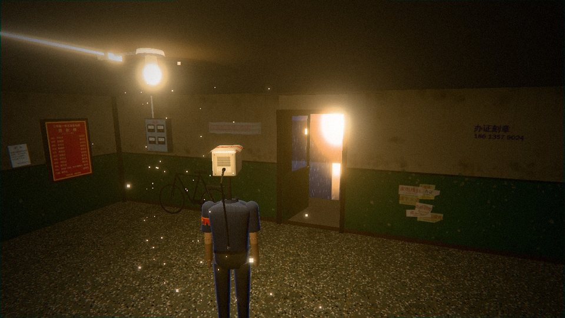
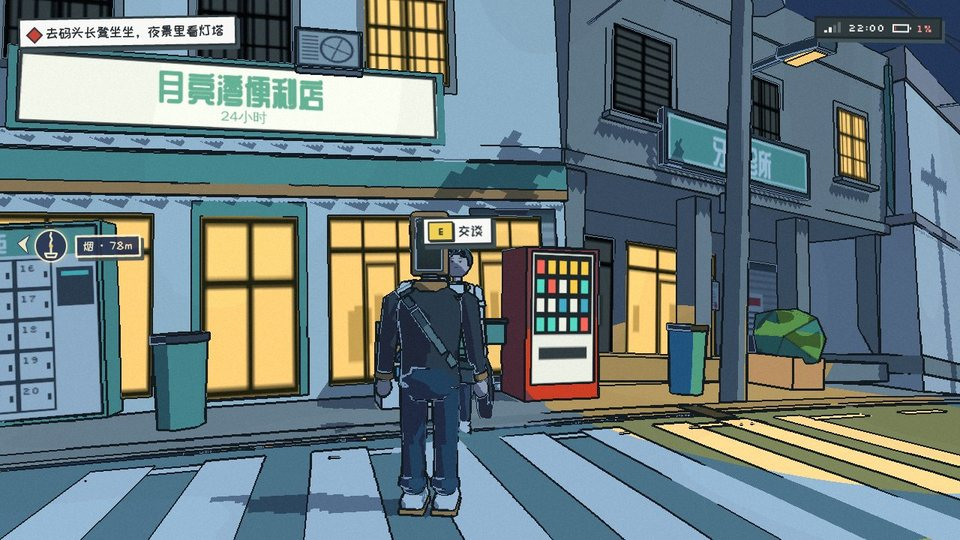
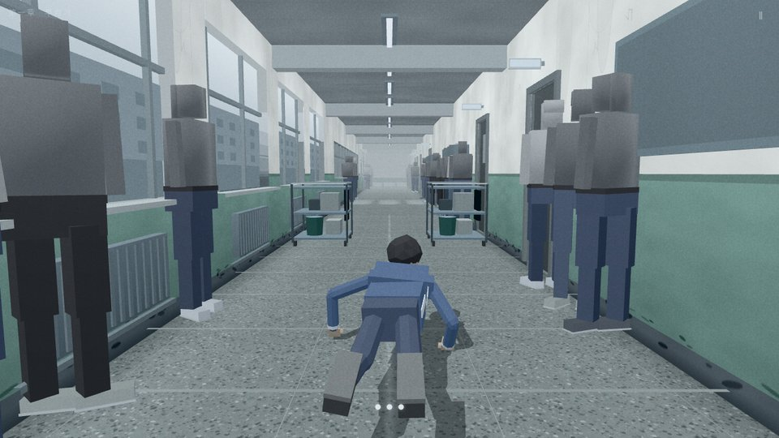
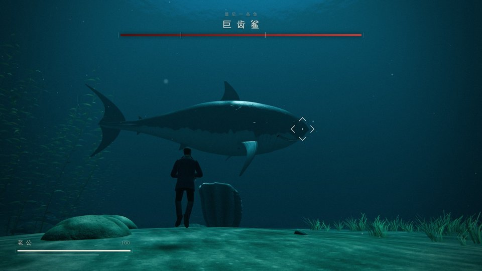
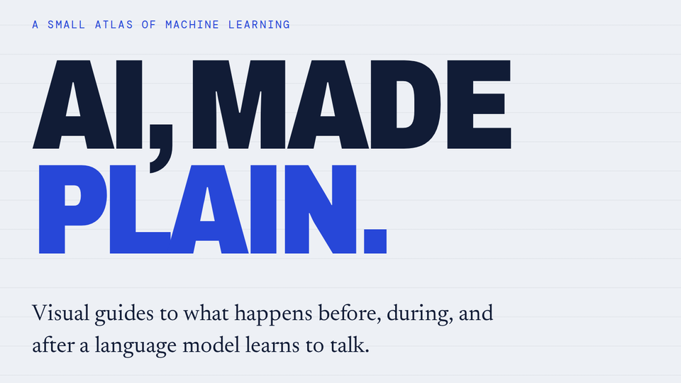

I'm EveGoodEvening. I tune AI coding agents and build plugins for them, write small libraries, make 3D browser games, and explain AI with pictures.

## Libraries

<table>
  <tr>
    <td valign="top">
      <a href="https://github.com/EveGoodEvening/v-ai-go-sdk"><b>v-ai-go-sdk</b></a> 
      Experimental unofficial Go client for Vercel AI Gateway — Responses, Chat Completions (with streaming), and Evaluation APIs. 
      <code>go get github.com/EveGoodEvening/v-ai-go-sdk</code>
    </td>
  </tr>
</table>

## Games

<table>
  <tbody>
    <tr>
      <td width="50%" valign="top">
        
        <h3><a href="https://github.com/EveGoodEvening/camhead-man">camhead-man</a></h3>
        <b>《天亮了，叫我 · 槐安里·七月半》</b> 
        A browser-based 3D urban-fantasy puzzle game where you play a security camera given a human body.  
        <a href="https://evegoodevening.github.io/camhead-man/"><b>Play online</b></a>
      </td>
      <td width="50%" valign="top">
        
        <h3><a href="https://github.com/EveGoodEvening/camhead-man-modern">camhead-man-modern</a></h3>
        <b>《显影 · 望潮里志怪》</b> 
        A browser-based small-planet urban-fantasy puzzle game where a camera-headed man uses photography to recover his face.  
        <a href="https://evegoodevening.github.io/camhead-man-modern/"><b>Play online</b></a>  
      </td>
    </tr>
  </tbody>
  <tbody>
    <tr>
      <td width="50%" valign="top">
        
        <h3><a href="https://github.com/EveGoodEvening/hand-walker-parkour">hand-walker-parkour</a></h3>
        <b>《手行者 · 跑酷》</b> 
        A browser-based three.js parkour game adapted from my AI-written novel <a href="https://github.com/EveGoodEvening/hand-walker">《手行者》</a>: walk on your hands through a high school, five chapters in about 15 minutes.  
        <a href="https://evegoodevening.github.io/hand-walker-parkour/"><b>Play online</b></a>
      </td>
      <td width="50%" valign="top">
        
        <h3><a href="https://github.com/EveGoodEvening/honey-i-want-fish">honey-i-want-fish</a></h3>
        <b>《老公，我想吃鱼了 · 深海·晚餐》</b> 
        A browser-based three.js underwater action game: a wife says she wants fish for dinner, so her husband dives into the East China Sea with a fish knife and fights a great white, two tiger sharks, and a 16-metre megalodon.  
        <a href="https://evegoodevening.github.io/honey-i-want-fish/"><b>Play online</b></a>  
      </td>
    </tr>
  </tbody>
  <tbody>
    <tr>
      <td width="50%" valign="top">
        
        <h3><a href="https://github.com/EveGoodEvening/flower-arranging">flower-arranging</a></h3>
        <b>拾花 · Fleur Atelier</b> 
        A browser-based 3D flower-arranging studio with procedural flowers and vases: compose bouquets, adjust each stem, and save or export your work.  
        <a href="https://evegoodevening.github.io/flower-arranging/"><b>Open the studio</b></a>
      </td>
      <td width="50%"></td>
    </tr>
  </tbody>
</table>

## Explainers & writing

<table>
  <tr>
    <td width="50%" valign="top">
      
      <h3><a href="https://github.com/EveGoodEvening/ai-eli5">ai-eli5</a></h3>
      AI concepts explained like you're five — visual, bilingual (EN / 简体中文) guides.  
      <a href="https://evegoodevening.github.io/ai-eli5/"><b>Browse the guides</b></a>
    </td>
    <td width="50%" valign="top">
      
      <h3><a href="https://github.com/EveGoodEvening/hand-walker">hand-walker</a></h3>
      <b>《手行者》</b> 
      An AI-written urban-fantasy novel (Chinese), now also a game: <a href="https://github.com/EveGoodEvening/hand-walker-parkour">hand-walker-parkour</a>.  
      <a href="https://github.com/EveGoodEvening/hand-walker/blob/main/%E7%AC%AC%201%20%E7%AB%A0.md"><b>Read chapter 1</b></a>  
    </td>
  </tr>
</table>
